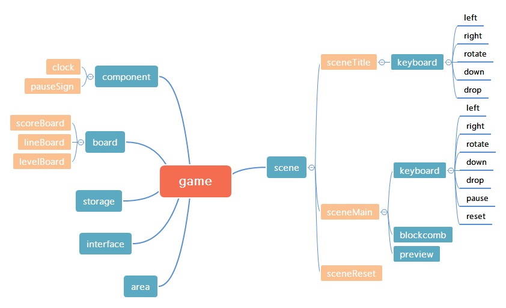

## Tetris

> 俄罗斯方块

游戏由原生javascript实现。界面模仿自 [chvin/react-tetris](https://github.com/chvin/react-tetris)，与以下图片类似：

此项目的所有功能都是由原生js实现。

## Features

- [x] 数据保存： 用localStorage对象保存游戏记录
- [x] 游戏按键模拟
- [x] 平滑的移动：通过 ActionController 限制了原生 keydown 的触发频率
- [ ] 移动端目前只测试通过iphone
- [x] 响应式：自适应高度，宽度
- [x] level: 一共有6个不同的级别，可以在初始时设置。每消除20行提升一个级别
- [ ] 音效
- [ ] 多种语言

所有与游戏相关的

## 整体结构

## Develop

### 安装

	npm install

### 运行

	npm start 浏览自动打开 http://127.0.0.1:8080/

### 打包编译
	
	npm run build

在build文件夹下生成结果。