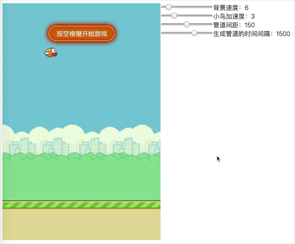

## Game Engine

试玩一下：

- [俄罗斯方块](https://cxphoe.github.io/Tetris/docs/) 支持移动端 / PC 端
- [Flappy Bird](https://cxphoe.github.io/Tetris/docs/bird.html)

> 基于 canvas 以及原生 js 实现的 2D 游戏引擎

- 游戏均由原生javascript实现。
- 根据 `游戏主体`、`游戏场景`、`游戏元素` 三个主要部分的层次实现事件管理，元素管理
- 游戏配置参数可动态调整，方便调试界面

`俄罗斯方块` 界面模仿自 [chvin/react-tetris](https://github.com/chvin/react-tetris)，与以下图片类似：

`Flappy Bird`:

## Develop

### 安装

	npm install

### 运行

	npm start 浏览自动打开 http://127.0.0.1:8080/index.html

### 打包编译
	
	npm run build

在build文件夹下生成结果。